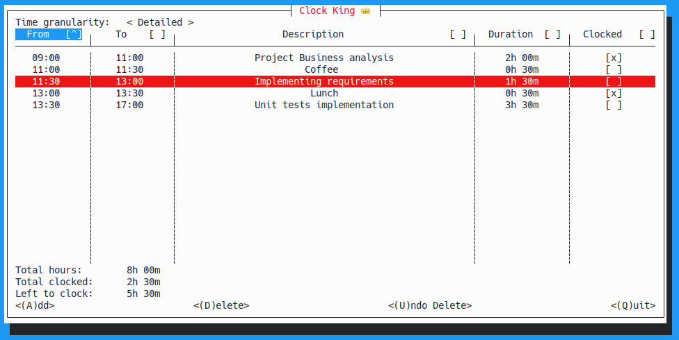
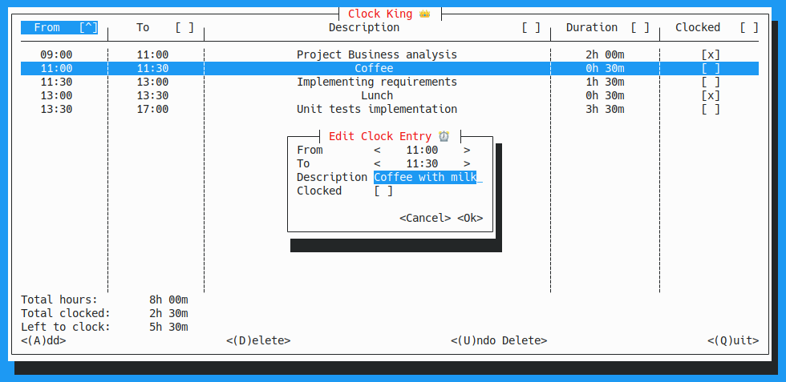

# Clock King

A console app for jotting down hours tracking for the day. 
Written to learn Rust with [Cursive](https://github.com/gyscos/cursive).

This is by no means state-of-the art Rust, but a fun weekend project. I've used it at work every now and then.

# Functionality

Meant as manual task list, where the results can be transferred to a time tracking app at the end of day. 

Keyboard shortcuts are listed on the screen, spacebar toggles whether an item is clocked or not. 

There is a time-granularity toggle for how detailed you want to be with your tracking.

The executable creates a `./.clockking/db.json` where the current list is stored. There's an autosave loop, and the data
gets saved when you quit the program normally.

