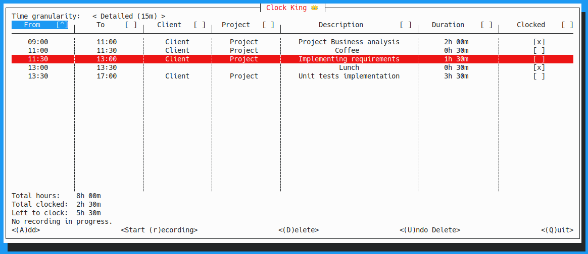
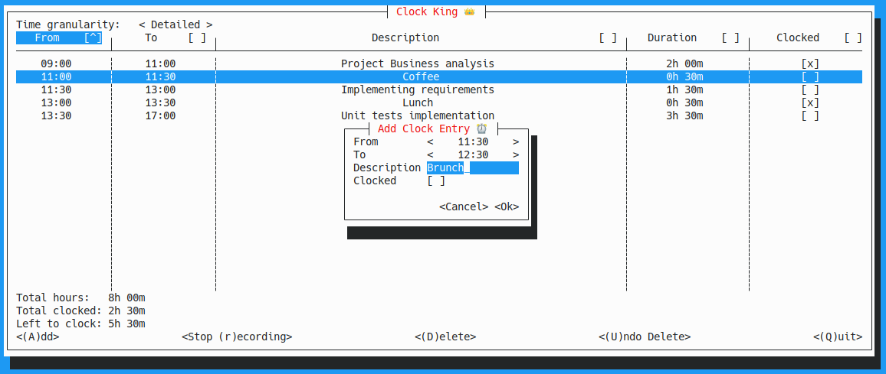
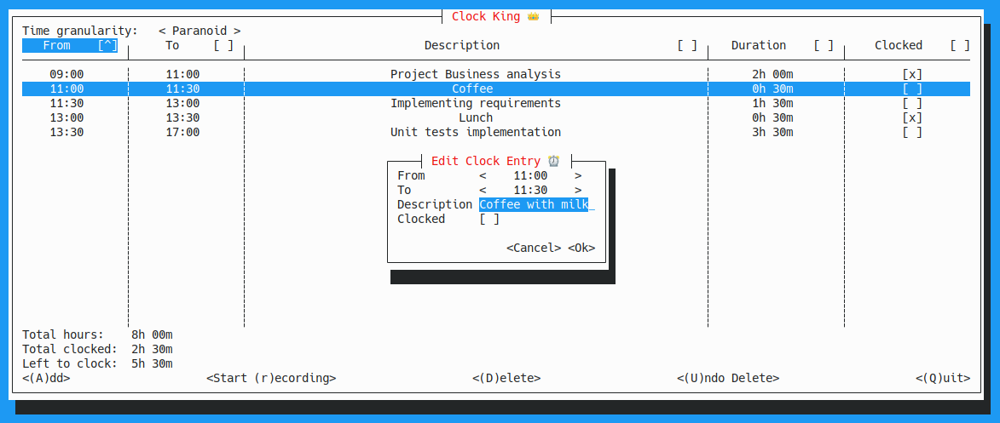
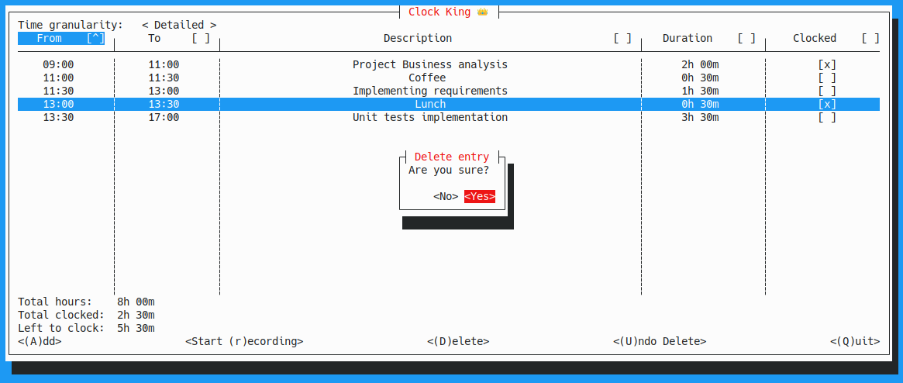
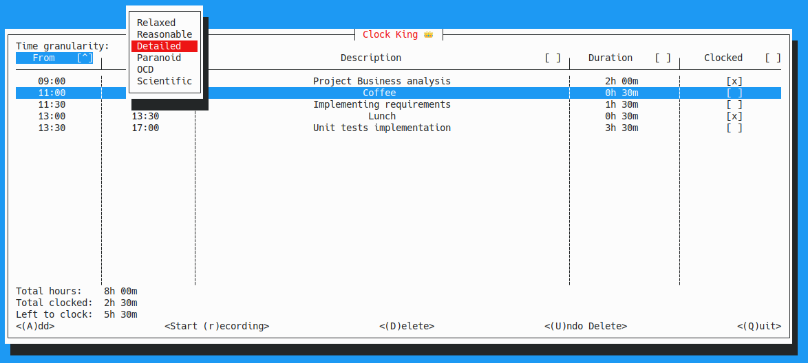
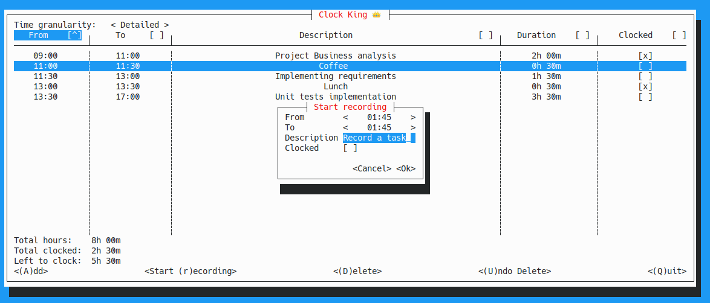
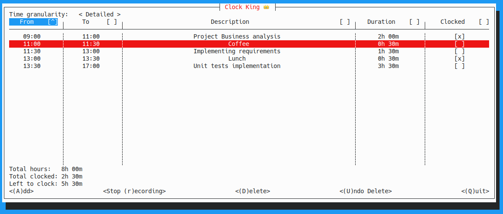
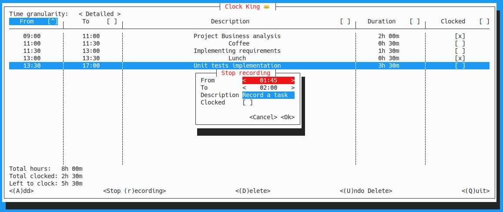

# Clock King

A console app for jotting down hours tracking for the day. 
Written to learn Rust with [Cursive](https://github.com/gyscos/cursive).

Meant as manual task list, where the results can be transferred to a time tracking app at the end of day. 

# Functionality

## Clock entries list

This is the main screen, and contains the list of clock entries that can be checked once they are entered to a time tracking app.

Keyboard shortcuts are listed on the screen buttons, spacebar toggles whether an item is clocked or not.

## Adding a clock entry

Pressing the `<(A)dd>` adds a new clock entry after the current selection in the table. Clock King tries to be smart and guess the end time of the task. 

## Editing a clock entry

Pressing `Enter` opens the edit form for the current selection.

## Deleting a clock entry

Entries can be deleted from the list, and restored from the undo buffer.

## Granularity

There is a time-granularity toggle for how detailed you want to be with your tracking.
- Relaxed (1h)
- Reasonable (30m)
- Detailed (15m)
- Paranoid (5m)
- OCD (1m)
- Scientific (1s)

Changing the granularity automatically adjusts existing entries.

## Record a new entry

By pressing `<Start (r)ecording>` you can submit details for a new entry you want to start recording. The start time
of the entry will be set to the current timestamp (rounded to the selected granularity). When you submit the data,
Clock Kings starts the recording.

You can continue working while Clock King records your entry in the background.

By pressing `<Stop (r)ecording>` Clock King stops the recording at the current timestamp, and you can submit the updated
entry details.

## File database

The executable creates a `./.clockking/db.json` where the current list is stored. There's an autosave thread, and the data
gets saved when you quit the program normally.

