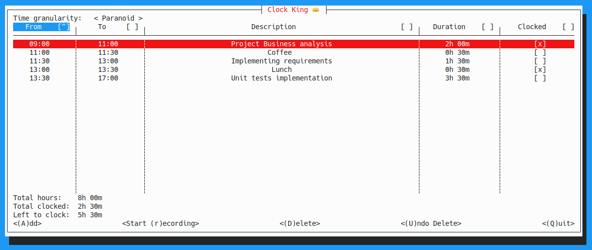

# Clock King

A console app for jotting down hours tracking for the day. 
Written to learn Rust with [Cursive](https://github.com/gyscos/cursive).

This is a prototype that I might clean up and expand gradually, it's by no means state-of-the art Rust.

# Description

Meant as manual task list, where the results can be transferred to a time tracking app at the end of day. 

Keyboard shortcuts are listed on the screen, spacebar toggles whether an item is clocked or not. 

The executable creates a `./.clockking/db.json` where the current list is stored.

